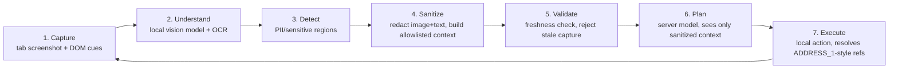

# On-Device Visual Perception for Browser Agents — Design

Project: SIH26171 — browser extension that understands the screen locally, redacts
private info before it leaves the device, and lets a server model plan the next
action against sanitized context only.

Status: design approved by requester on 2026-09-08. No code written yet
(fresh project, empty repo). Solo/small builder covering all roles sequentially
(no fixed deadline).

## 1. Scope decisions

- Browser target: **Chrome/Chromium only** for the first working prototype.
  Firefox is a stretch goal, not a blocker.
- First end-to-end milestone: **fill a form field from a private value** —
  e.g. autofill a synthetic shipping address on a fake checkout page, where the
  extension resolves an `ADDRESS_1`-style placeholder locally and the server
  planner never sees the real address.
- Tech stack (settled, per design review): TypeScript Chrome extension
  (Manifest V3), ONNX Runtime Web for local vision inference, local DOM/OCR
  cues for text, **FastAPI (Python)** server for the planner (chosen over
  Node — Pydantic gives free schema validation on both the request and
  response side), deterministic evaluation harness.
- Build strategy: **vertical slice first, then harden** (Approach B). Prove the
  full loop end-to-end on one page before deepening any single stage. This
  matches the source PDF's own "first 48 hours: prove feasibility" and
  "do not add complexity before proving the loop" guidance.

## 2. Architecture

Seven-stage pipeline, split across two processes:

- **Chrome extension** owns stages 1, 2, 3, 4, 5, 7 — everything
  privacy-sensitive stays on-device.
- **Server** owns stage 6 only — receives sanitized text/image plus
  placeholders, returns a schema-constrained action. It never receives raw
  secrets.

## 3. Phase plan

| Phase | Goal | Exit criteria |
|---|---|---|
| 0. Skeleton | Extension scaffold (Manifest V3) + FastAPI server talking over localhost, on a shared schema | Extension POSTs hardcoded JSON, server validates it via Pydantic and returns a hardcoded action; extension validates the action shape before "executing" (still a no-op) |
| 1. Vertical slice (feasibility) — see §3.1 for full task-level detail | Full loop on one fake checkout page with a seeded visible secret and a separate local secret source, real local vision inference, task/target-bound placeholder execution, and automated leak checks | See §3.1 acceptance list — no video-only proof |
| 2. Real detection & redaction | Replace toy regex with a real PII/field classifier (structured patterns + local OCR + visual class); add pixel + text redaction; add negative/no-PII test pages | Per-category precision/recall numbers on a small labeled set |
| 3. Dynamic-page & freshness handling | Broaden Phase 1's basic freshness/replay checks to full dynamic-page support: typing, autofill, scroll, layout shift; re-observe after execute | Test cases with layout shifts don't leak stale context |
| 4. Benchmark harness | Held-out test pages (unseen layouts), latency (p50/p95), resource usage (CPU/GPU/memory), baseline comparison (DOM-only / OCR-only) | Reproducible report: accuracy, leakage, latency, resource numbers |
| 5. Hardening & demo polish | Firefox fallback (stretch), live-view UI showing sanitized payload before send, failure/abstention handling, packaging | 90s demo script runs cleanly end to end |

### 3.1 Phase 1 task-level plan (revised per design review)

**Scoped privacy claim** (replaces "the secret never leaves the device"):
protection is demonstrated for the synthetic fixture values under this
extension's own outbound channel, not as a universal PII guarantee, and not
covering the destination page's own behavior once a value is filled into it
(filling a field necessarily exposes that value to the page it's filled into
— that's out of scope for the planner-channel privacy claim).

**Tasks:**

1. **Fixture page**: one local fake-checkout HTML page with (a) a visible
   seeded sensitive region (e.g. an address already printed on the page, as
   if from a "saved addresses" list) that must be redacted from anything sent
   to the server, and (b) an empty shipping-address input that must be filled
   from (c) a separate local synthetic-value source (extension-side, e.g. a
   small local JSON "vault" seeded with a fake identity) — not derived from
   the visible region. This exercises both redaction and fill in one fixture.

2. **Real local vision inference**: pick one concrete candidate model
   (name, artifact source, license) for element/region detection, define its
   preprocessing and output contract, and run it via ONNX Runtime Web inside
   the extension against the fixture page — measured, not stubbed. If the
   candidate fails to load/run, the milestone fails on that axis (a stub may
   exist only to unblock unrelated scaffolding work, never to pass this
   exit criterion). Timeout or inference failure → treat as abstention
   (stage 5's "stop the upload" rule), with a bounded fallback decision
   (e.g. block the task) rather than silently degrading.

3. **Task/target-bound placeholder vault + strict action contract**:
   - Local synthetic values live only in extension memory, tagged with the
     task id, allowed destination (origin + specific field/target id), and
     an observation version.
   - They expire on task completion, navigation, or cancellation.
   - The server may return only a schema-constrained fill action: `{action:
     "fill", target: <opaque target id from this observation>, valueRef:
     "ADDRESS_1"}` — no selectors, scripts, arbitrary destinations, or raw
     values from the server.
   - The extension rejects: unknown `valueRef`, a target not bound to this
     task/observation, a replayed action (same action id seen twice), and
     any action whose target's origin/tab no longer matches what was
     observed.

4. **Freshness/replay checks (basic, Phase-1 scope)**: bind each observation
   to `(task id, tab id, document/origin, observation version)`. Before
   executing any returned action, re-validate that binding against current
   page state; if the tab navigated, the target element was replaced, or the
   origin changed since observation, reject and require a fresh
   capture — do not execute. Add a test that delays the "server response"
   artificially and mutates the page in between, asserting the stale action
   is rejected.

5. **Automated outbound-payload leak checks** (replaces video-only proof):
   a single allowlisted payload-builder function is the *only* code path
   allowed to construct what gets sent to the server (no raw DOM dump,
   full screenshot, URL query string, debug log, or ad-hoc telemetry may
   leave the extension by any other path). A test harness intercepts every
   outbound request and every server-side log line and asserts the fixture's
   synthetic secret values (and the visible seeded region's content) never
   appear, including when decoding any uploaded image bytes. If sanitization
   or the vision model fails, assert nothing was uploaded at all.

**Phase 1 acceptance (all required, recording is supplementary evidence only,
not proof by itself):**
- Intended field is filled correctly from the local vault.
- No synthetic secret (vault value or seeded visible region) appears in any
  captured outbound planner request or server log, including decoded image
  content.
- No upload occurs following a sanitization or model failure.
- Stale, replayed, malformed, wrong-target, and unauthorized-`valueRef`
  actions are all rejected with no execution.
- Real local model inference against the fixture is demonstrated (not a
  stub).

### 3.2 Phase 0 settled details

- **Server**: FastAPI, single process, `uvicorn` locally on a fixed
  localhost port; request/response bodies are Pydantic models mirroring the
  shared JSON schema (see below).
- **Extension execution contexts**: Manifest V3 background service worker
  owns capture (`chrome.tabs.captureVisibleTab`), the fetch to the localhost
  server, and the placeholder vault; a content script owns DOM reads/writes
  (element targeting, filling) and reports back to the background worker via
  `chrome.runtime` messaging. Minimum permissions: `activeTab`, `scripting`,
  and a host permission scoped to the localhost server origin only (no
  broad `<all_urls>`).
- **Shared schema**: one JSON Schema (or TypeScript-source-of-truth mirrored
  into Pydantic) defining the sanitized request payload and the action
  response, checked into the repo so both sides fail loudly on drift rather
  than silently diverging.
- **Run commands**: `npm run build` / `npm run dev` (extension, loaded
  unpacked into Chrome) and `uvicorn server.main:app --reload` (server);
  both documented in a top-level `README.md` once Phase 0 scaffolding
  exists.
- Phase 0 payloads stay synthetic and hardcoded — no real model or fixture
  wiring yet; that starts in Phase 1.

## 4. Error handling

- Model crash / timeout / uncertain capture → stop the agent upload or redact
  conservatively; never fall back to sending a raw screenshot.
- Stale capture (page changed mid-pipeline) → discard and re-capture; never
  send stale context.
- Unresolvable or unauthorized placeholder reference (e.g. `ADDRESS_1` used
  outside its allowed task/destination) → block execution, surface to user.
- Out-of-schema or out-of-scope server action → reject locally before
  executing (bounded action schema, not free-form actions).

## 5. Testing

Tested per phase, not only at the end:

- Phase 1: manual scripted run + recorded video (feasibility proof).
- Phase 2: labeled synthetic-PII test set — precision/recall per category,
  including hard negatives.
- Phase 3: dynamic-page test cases — typing mid-capture, layout shift,
  autofill race conditions.
- Phase 4: held-out unseen layouts, latency/resource measurement script,
  comparison against DOM-only and OCR-only baselines.
- Throughout: synthetic identities only — no real personal data.

## 6. Open items for later phases

- Firefox capture-permission differences (deferred to Phase 5).
- Which local vision model/detector to standardize on (decide during Phase 1
  once a real model has been run and measured, not before).
- Exact PII category list and labeling schema for Phase 2's test set.
